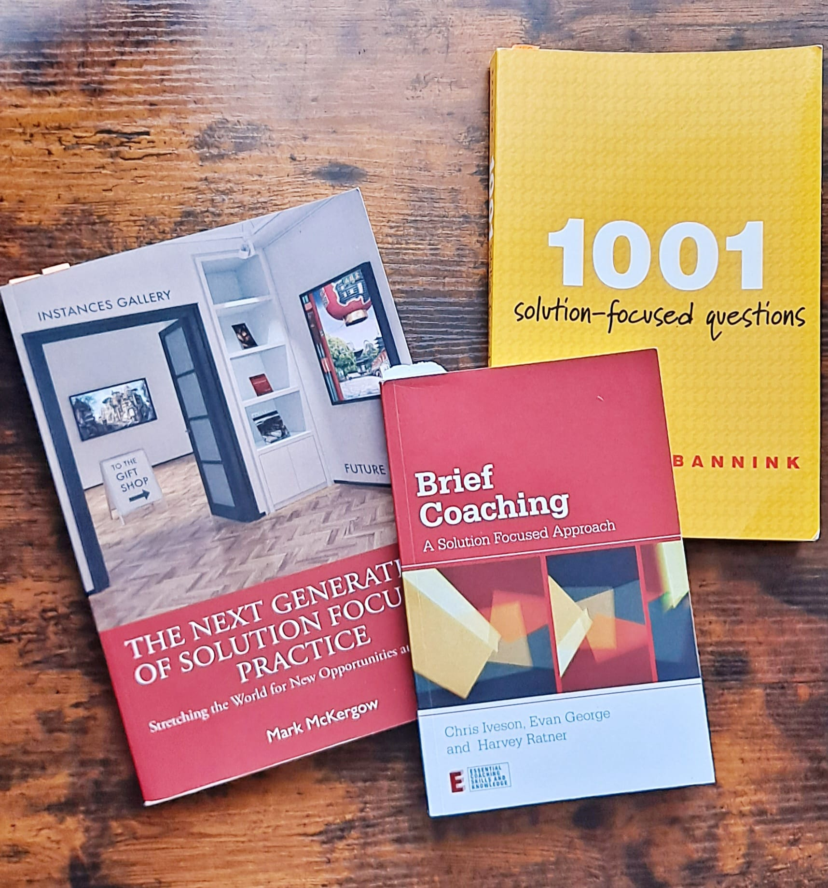

## Why become a coach?
Learning coaching techniques provides benefit to almost every walk of life. Coaching techniques, while often used in the workplace are equally effective in assisting positive change across the entire range of human endevour. Business, teamwork, collaboration, athletic performance, creativity, relationships, health, fitness, spirituality and wellbeing are just some of the things that coaches have developed specialised focus on. However anyone who learns coaching can apply the principles to themselves in order to facilitate change.

## What's so special about Solution Focused practice?
Many counselling and coaching methods start with the principle that in order to solve a 'problem' we must first learn everything we can about it. This often presumes that a person with specialist domain knowledge, a psycho-analyst for example, will be invited to assist a client who, by definition, lacks this skill.

Solution Focused coaching is different in two important ways. (1) It starts with the assumption that change is generated by the client, not the facilitator. It presupposes that the client already posesses the skills, resources and experience necessary to make any change they find necessary in their lives. (2) It does not agree with the connection between problem analysis and solving problems. Instead, it sees solutions as an emergent process that comes from clarity about what future is preferred.

## Where can I start?
One of the things I love about Solution Focused work is that learning the fundamentals is reasonably easy. One of the hardest things is letting go of our encultured perception that problem analysis is linked to problem solving. That bad habit can be broken by studiously sticking to a set of reasonably pre-defined Solution Focused questions.

Almost everything you need to know about Solution Focused coaching can be learned by reading two or three books.

The first I would recommed is Brief Coaching by Iveson, George, Ratner. It is slightly more therapy centric, but it covers the princlples and gives many useful examples of Solution Focused conversations.

The second book, Next Generation of Solution Focused Practice, McKergow, gives a good grounding in the history and development of the technique, followed by an easy to use guide for Solution Focused conversations, the 'Solution Focused Art Gallery.'

The third book is simply a long list of example questions. Between these three textbooks, you can gain a grounding in the principles and practice of Solution Focused coaching.

It is sometimes said that Solution Focused theory is easy, but in practice, can be more challenging. So the next step after reading is finding a practice group, or joining a course.

