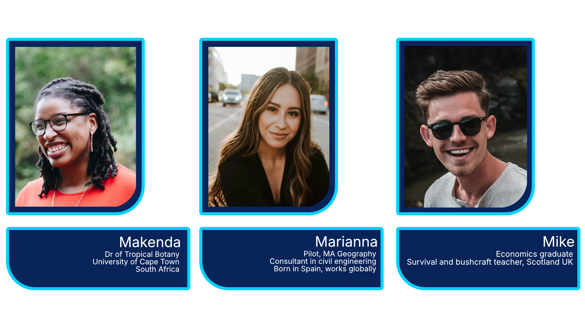

**A Solution Focused Parable** #Umwelt #Field-of-affordances

> - Makenda, from South Africa, Dr of Tropical Botany, University of Cape Town, South Africa.
> - Marianna, from Spain, pilot and post-graduate geographer - travels the world as a consultant for civil engineering projects.
> - Mike, from the UK, economist retrained, now teaching survival and bushcraft in Scotland UK.

---

## A crash landing

**Makenda and Mike look anxiously out of the window of their single engine Cessna plane.** Their pilot and friend, Marianna, has been taking them on a flight across Peru, to see Machu Picchu from the air, and then into the Amazon. But something is wrong. The plane engine is smoking, and they are looking for a place to land.

Suddenly Makenda spots it. A small, flat clearing by a straight part of a river, one of the many tributaries to the vast Amazon. Makenda has always been good at observation. She grew up in the city and teaches tropical botany in a university in South Africa where they all met as undergraduates.

Marianna's father flew crop dusting planes in her home town in the Spanish countryside, so flying was in her blood. But her real passion was geography, and she would spend hours gazing at her Dad's flying maps, trying to understand the lay of the land.

She takes the plane in a tight circle. She can feel the engine is close to failure, and she uses the river to drop speed and height as she angles into the bank. The landing demonstrates expert flying skills she didn't know she had. The plane grinds to a halt, a wing clipping the forest just as it stops. Mike gasps, he didn't realise he'd been holding his breath.

As they climb out of the plane the engine fire takes hold. They have just seconds to grab their bags.

From the other end of the clearing, they watch the plane burn. Through the fog of shock, Mike starts to consider their situation. His degree in economics is no use here. But after ten years in London, he turned his back on the corporate life, retrained in survival skills, and started working for an outdoors centre in Scotland. Perhaps they can survive long enough to get to a village. But which direction should they go?

The clearing had been used by people for a while, yet nothing was left but a couple of rotten planks and dirt squares where some huts once stood. Still in shock, they find an old path, and walk into the edge of the forest. Several meters in they stop and look around.

## The first look

In the panic, Marianna didn't pick up the flight map and it was lost in the plane. But she has a knack for memorising maps. She knows from the flight plan and the sun which way is North. She recognised the river behind them and through the trees she sees a mountain she remembers from the map. There is a community to the West, perhaps a two or three day hike. They will have to get across the mountain and then follow the large river behind upstream. The village is on the river and there is a small airstrip there.

Makenda is lost. She knew that the flight plan took them on a sightseeing tour, past the Inca ruins and into the Amazon. But this is nothing she prepared for. She looks at Mike. He has a frown. Mike knows survival, but every plant here looks strange. Indeed, some look downright dangerous.

## Same view, different eyes

As Marianna gazes at the forest, she sees an alien landscape. She knows planes, maps and the emergence of land use zones in cities. There are berries in several of the bushes. But they could kill her. It is a clear morning, but they have no shelter against the rain. She knows the way to go, but they need food and maybe fire. She feels desperate. Perhaps there are wild animals here. This is a dangerous place to be alone.

Mike looks at the same view. He knows maps too, but he didn't memorise this one. The mountain, visible through the trees is one of many they passed. It could be anywhere. As he looks forwards, he sees a plant with huge leaves. The jungle is alien to him, but this plant could form the makings of a shelter. He turns in a circle. Behind them, by the clearing, he spots a fallen tree. Miraculously he can see dry deadwood as some branches have broken partially free from the trunk. He then sees some dry grass beside them. Within just 20 meters of their landing, they have the possibility of shelter and fire. But what are they going to eat? He knows survival in Northern Europe. Every plant here is strange.

Makenda stands beside her friends. It is not her first time in the Amazon jungle. As a specialist in tropical rain-forest, she did her doctoral thesis on plants from the Amazon basin. There is a bush just three meters in front of them, full of berries which are not only edible but delicious. Just to her right, a tree with leaves that indigenous healers use as a medicine. But she grew up in the city. She has no idea how to cope with what will come next.

## So what has this got to do with coaching?

Jakob von Uexküll first introduced the concept of _Umwelt_ in his 1909 book titled Environment and Inner World of Animals. In this work, he explored how different animals perceive and interact with their environment based on their sensory capacities and subjective experiences.

The term gained more prominence and philosophical development in his later work, _Theoretical Biology_ (1920), where he elaborated on the idea that every living being exists within a unique experiential world, shaped by how it perceives its surroundings.

In Solution Focused coaching we sometimes refer to this as the Field of Affordances. This is the sum total of the opportunities for action that you can see in the environment around you.

When presented with the same clearing, forest and landscape, our three heroes see different things because of the skills, resources and experiences they bring to the moment.

- Marianna the geographer can see the big picture landscape, and can find a way back to civilisation.
- Mike the survival expert can see objects in the forest that can be used to create fire, shelter and perhaps even weapons for guarding against wild animals, or splints for a broken ankle.
- Makenda sees none of this, but she recognises almost every plant she sees, there utility for food, water and sometimes even medicinal use.

## Finding their way home

Our three heroes are on a path by a river bank. They've been walking for a week. They see the forest thin out in front of them, and then they step into a new world. Ahead of them is a beautiful vista. The forest has been cleared to make way for wooden buildings. Children are playing by the water. Several boats are moored up, and they can hear a generator. Weary but elated, they walk into the village. But how did they survive?

1. Why teams can achieve more

Our first observation must be about teams. Alone, our heroes may not survive the jungle long enough to make it to safety. But together, their collection of skills will allow them to easily last a three day journey, or even longer. It will not be easy, but they can do it.

We sometimes forget that to be human is to be a communal animal. We are not a lone species; we have never wandered the savanna or jungles as isolated individuals -our power has always been in cooperation. A group of three can survive for a while. A tribe of twelve can survive even if one person is hurt. As teams get larger, the cost of collaboration increases (things take longer to achieve), but so does the benefit. It took many people to build the Golden Gate Bridge, but working as a collective towards a common goal created a miracle of engineering.

2. The power of coaching

The second observation is about the Umwelt of each of our team members. As they talk to each other, they might uncover resources in themselves that they had forgotten about. Perhaps in the initial panic, one of them forgets that they learned in their twenties how breathing exercises can reduce stress and decrease blood flow in case of a trauma. Or maybe they might recall how, during the last year, they went on a team building away day and learned how to have conversations about trust and maintaining hope.

3. How mentoring, training and education expands our options for action

Not only can our hero's Unwelts be expanded through exploring their own skills, resources and experiences, but they can teach each other to see the forest in a different and more expansive way. Mike could teach Marianna how to make a shelter. Makenda can teach Mike how to collect edible fruit. It is the same forest, but it is no longer as frightening, because for each of them, they see a larger number of opportunities for personal and collective action.

## The power of coaching
Expanding our world is the core of what coaching conversations are about, and is at the heart of the solution focused approach. This story has been adapted from an original to demonstrate the power of coaching, teams and mentoring, but its core observations are the same: we each look out at the same world, but see different opportunities for action. Both in life and in business, the act of having a 'useful' conversation with a coach is a powerful tool to rediscover prior skills, resources and experiences which we can use to create powerful change in our lives, both at home and at work.

But by getting clarity on our preferred future, we will notice if the path towards it implies learning new skills. Solution Focused questions can remind us of our capacity for learning and our mental flexibility. The way forward is then apparent, and may not require further sessions, as empowered action is an emergent consequence of the conversation. This is the power of Solutions Focused coaching.

__

Image credits: Unsplash and Pexels. This is an adaptation of an original story, the names and profiles are fictional.
